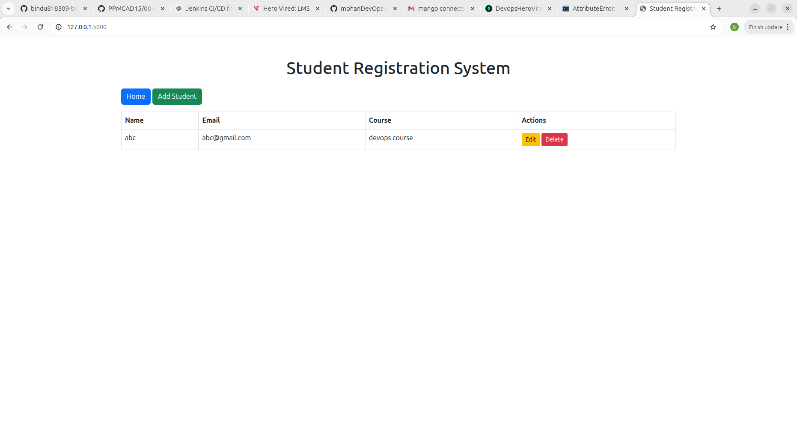
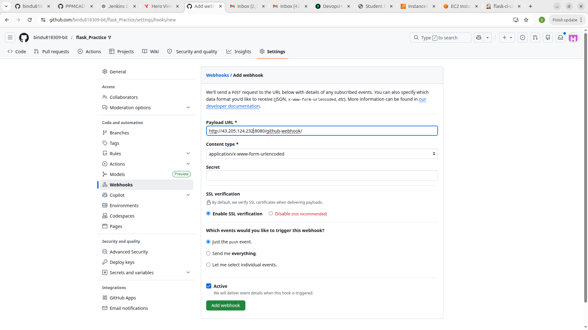
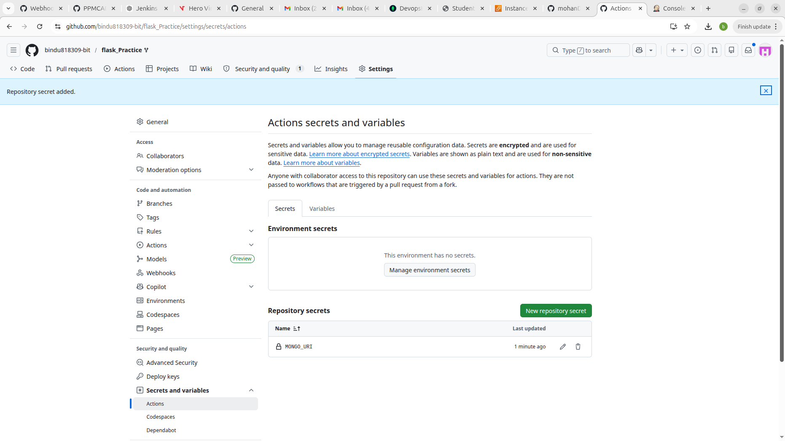
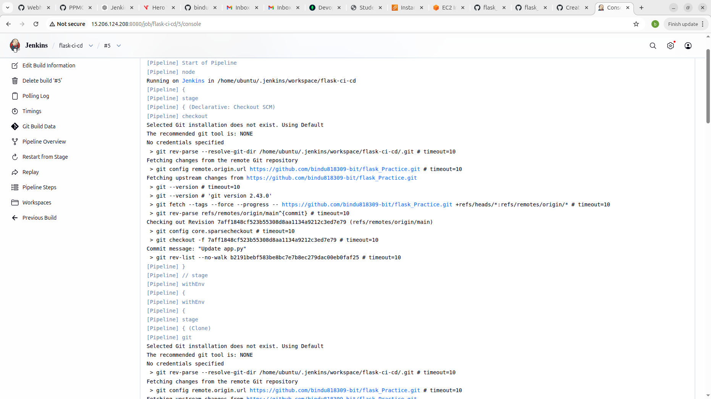
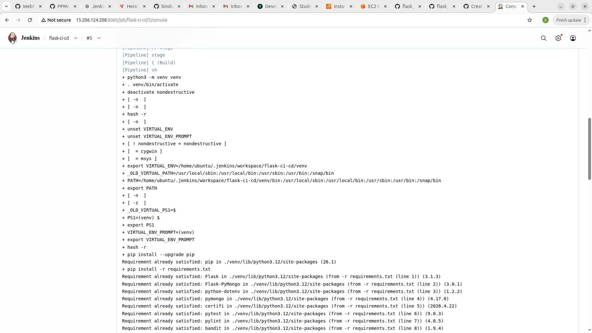
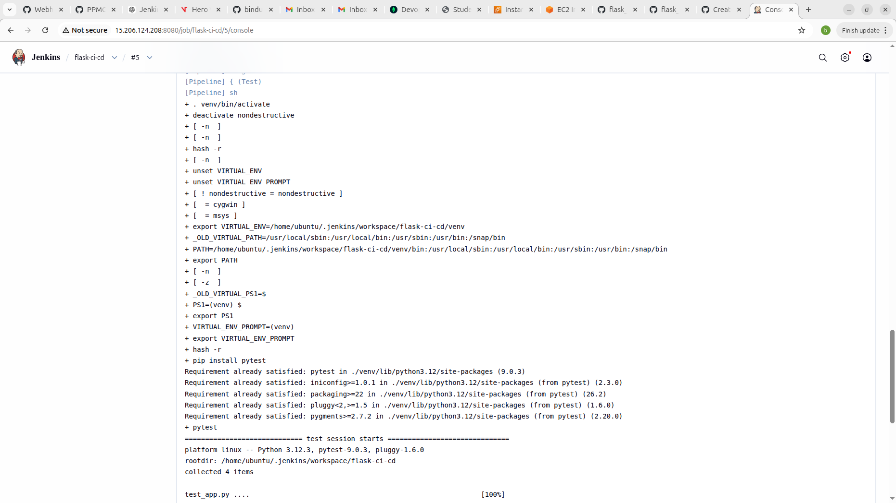
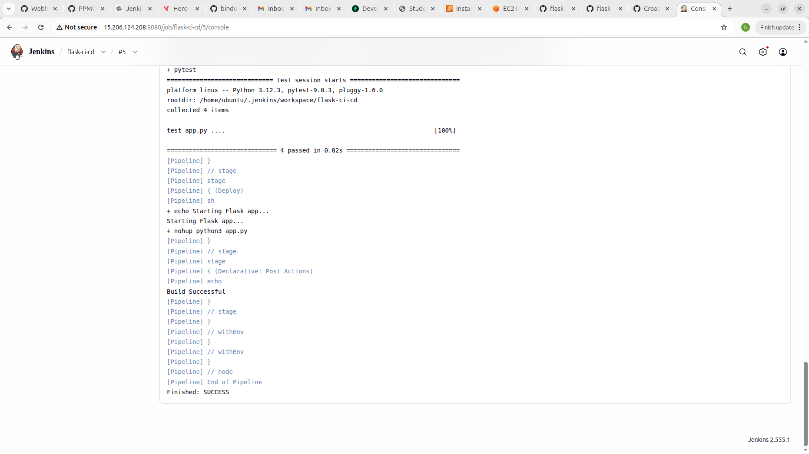
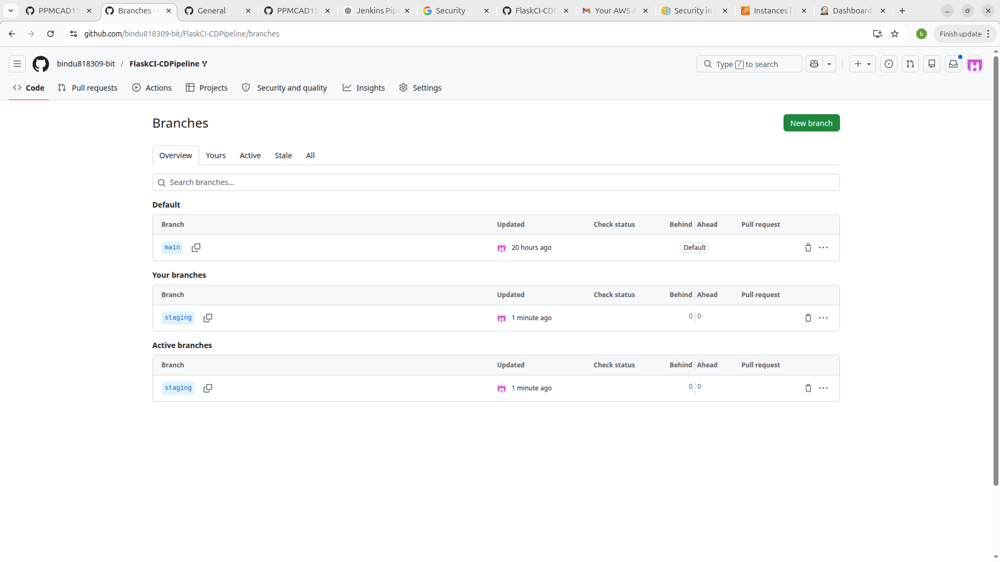
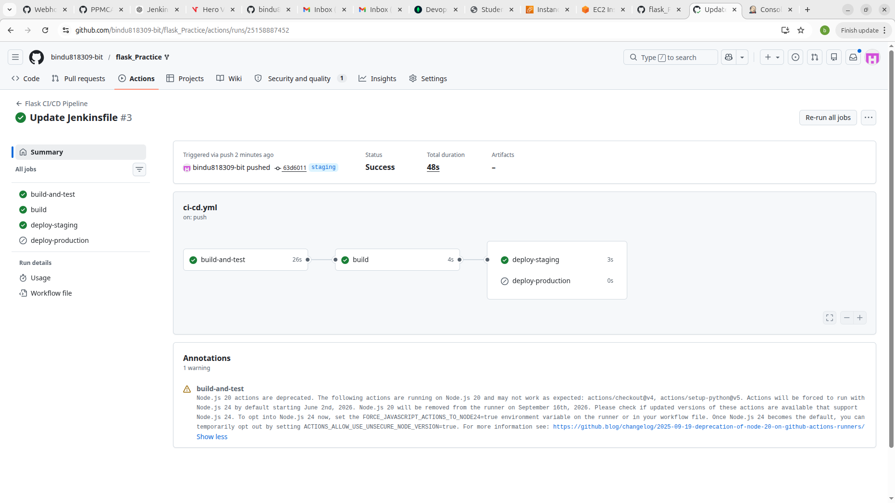
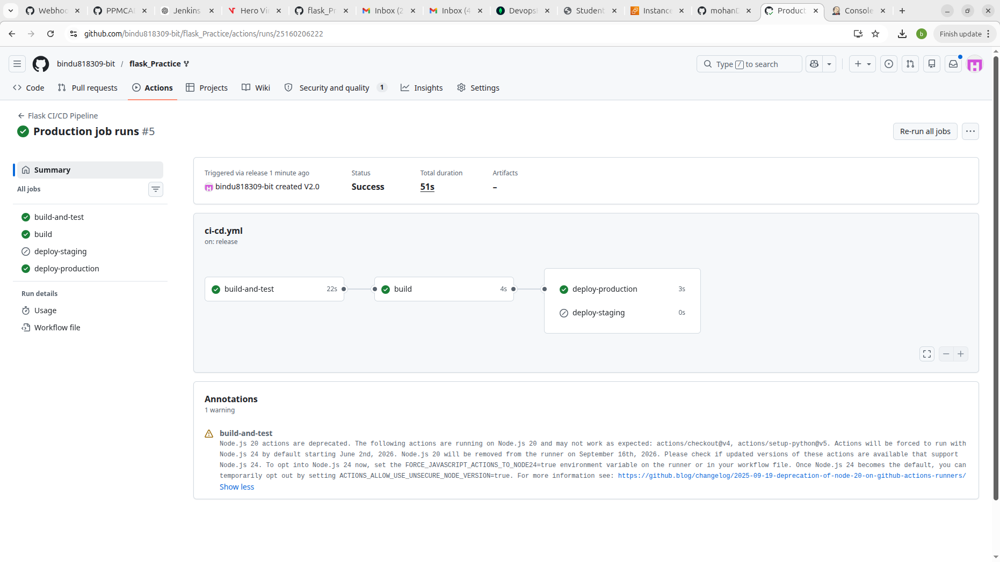

# Student Registration System

A simple **Flask** web application to manage student records with **MongoDB** as the backend database. Users can **add, view, update, and delete** student details.

---

## Features

* List all students on the home page
* Add a new student
* Update existing student details
* Delete a student with confirmation
* Simple and responsive UI using Bootstrap

---

## Tech Stack

* **Backend:** Python, Flask
* **Database:** MongoDB (via Flask-PyMongo)
* **Frontend:** HTML, Jinja2 templates, Bootstrap 5
* **Environment Variables:** Managed via `.env` file

---

## Setup Instructions

### 1. Clone the repository

```bash
git clone <your-repo-url>
cd <repo-folder>
```

### 2. Create and activate a virtual environment

```bash
python -m venv venv
# Activate venv
# Windows:
venv\Scripts\activate
# Linux / Mac:
source venv/bin/activate
```

### 3. Install dependencies

```bash
pip install -r requirements.txt
```

**`requirements.txt` example:**

```
Flask
Flask-PyMongo
python-dotenv
bson
```

### 4. Configure environment variables

Create a `.env` file in the project root:

```
MONGO_URI=<your-mongodb-connection-string>
SECRET_KEY=<your-secret-key>
```

### 5. Run the application

```bash
python app.py
```

Open your browser at: [http://localhost:8000](http://localhost:8000)

---

## Project Structure

```
project/
│
├── templates/
│   ├── base.html
│   ├── index.html
│   ├── add_student.html
│   ├── update_student.html
│
├── app.py
├── requirements.txt
└── .env
```

# 🚀 Jenkins CI/CD Pipeline for Flask Application

## 📌 Overview
This project demonstrates how to implement a **CI/CD pipeline using Jenkins** for a simple Flask web application.  
The pipeline automates the process of building, testing, and deploying the application.

---

## 🛠️ Tech Stack
- Python 3
- Flask
- Pytest
- Jenkins
- GitHub


Start Jenkins:

sudo systemctl start jenkins

Access:

http://<your-server-ip>:8080

Install plugins:

Git Plugin
Pipeline Plugin
Email Extension Plugin
Screenshots


# Jenkins Page



# WebhookConfig



🔐 GitHub Secrets

Configure secrets in:
Settings → Secrets → Actions

# SecretConfig



# Jenkins console Output StageWise









# 🚀 Flask CI/CD Pipeline using GitHub Actions
## 📌 Overview

This project demonstrates a CI/CD pipeline for a Flask application using GitHub Actions.

```
📁 Project Structure
flask-app/
│── app.py
│── requirements.txt
│── test_app.py
│── .github/workflows/ci-cd.yml
│── README.md
```
⚙️ CI/CD Workflow

The pipeline performs the following steps:

✅ 1. Install Dependencies

Installs required Python packages using pip.

✅ 2. Run Tests

Executes tests using pytest.

✅ 3. Build

Prepares application for deployment.

## Branching UI



# 🚀 4. Deploy to Staging
Trigger: Push to staging branch

## Staging deployment




# 🚀 5. Deploy to Production
Trigger: Release tag creation

## ProdDeploymentTrigger




Required secrets:

STAGING_SERVER
STAGING_SSH_KEY
PROD_SERVER
PROD_SSH_KEY
API_TOKEN
#🛠️ How to Run
Push to staging:
git checkout staging
git push origin staging
Create production release:
git tag v1.0
git push origin v1.0

📌 Author

Bindu Reddy

---

## License

MIT License

---


